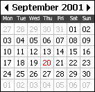



## tCalendar

### Description

Calendar user control - lightweight and simple to use - full source code included
 
### More Info
 

             |
---                |---
**Submitted On**   |2001-09-18 17:03:10
**By**             |[Tony Neilsen](https://github.com/Planet-Source-Code/PSCIndex/blob/master/ByAuthor/tony-neilsen.md)
**Level**          |Intermediate
**User Rating**    |4.9 (44 globes from 9 users)
**Compatibility**  |VB 5\.0, VB 6\.0
**Category**       |[Custom Controls/ Forms/  Menus](https://github.com/Planet-Source-Code/PSCIndex/blob/master/ByCategory/custom-controls-forms-menus__1-4.md)
**World**          |[Visual Basic](https://github.com/Planet-Source-Code/PSCIndex/blob/master/ByWorld/visual-basic.md)
**Archive File**   |[tCalendar265979182001\.zip](https://github.com/Planet-Source-Code/tony-neilsen-tcalendar__1-27332/archive/master.zip)

